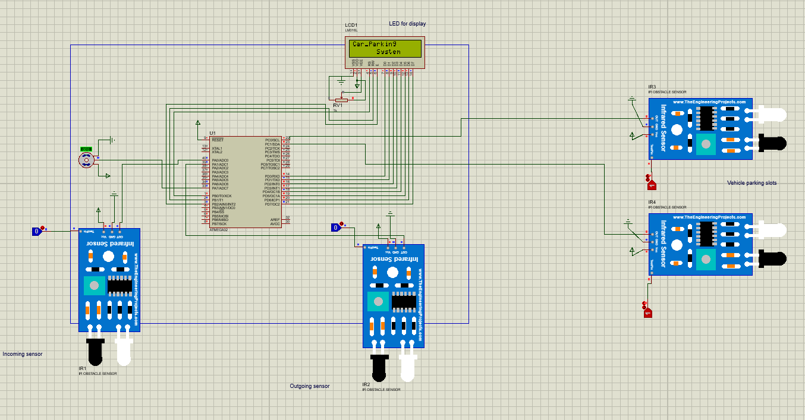

# Automatic Vehicle Parking System

## Overview

This project implements an automated vehicle parking system using the ATmega32 microcontroller. It optimizes parking space utilization and enhances user convenience through automation and sensor integration.

---

## Folder Structure

```
├── GccApplication4.zip # Main C code for ATmega32 microcontroller
├── Infrared Sensor Library for Proteus.zip # IR sensor library for Proteus simulation
├── Proteus simulation.pdsprj # Proteus simulation project file
├── README.md # This documentation file
├── circuit image/ # Images of the circuit diagram
└── demo video.mp4 # Video demonstrating the system

```

---

## Components Used

- **Microcontroller:** ATmega32
- **Sensors:** Infrared (IR) sensors for vehicle detection
- **Software:** Proteus for simulation, GCC for microcontroller programming

---

## Setup Instructions

### Hardware Setup

1. Use the ATmega32 microcontroller.
2. Connect infrared sensors to detect vehicle presence.
3. Provide appropriate power supply (5V or 9V DC) to the microcontroller.
4. Connect other components as shown in the circuit diagram (see `circuit image` folder).

### Software Setup

1. Extract `GccApplication4.zip` to access the microcontroller C code.
2. Program the ATmega32 microcontroller with the provided code using your preferred programming tool.
3. Extract `Infrared Sensor Library for Proteus.zip` and add it to your Proteus libraries.
4. Open `Proteus simulation.pdsprj` in Proteus.
5. Load the HEX file generated from the C code (`GccApplication4.hex`) into the microcontroller component in Proteus.
6. Run the simulation to test the system.

---

## How to Run

- **In Proteus Simulator:**  
  Open `Proteus simulation.pdsprj` and start the simulation. Observe how the infrared sensors detect vehicles and how the parking system reacts accordingly.

- **On Actual Hardware:**  
  1. Program the ATmega32 microcontroller with the provided C code.  
  2. Set up the hardware circuit as per the schematic in the `circuit image` folder.  
  3. Power up the system and test vehicle detection and parking automation.

---

## Demonstration



Watch the demo video here:

[Demo Video](./demo%20video.mp4)

---

## Credits

Created and maintained by **Manoj Pandekamat**.

Special thanks to all contributors and open-source projects that made this work possible.
